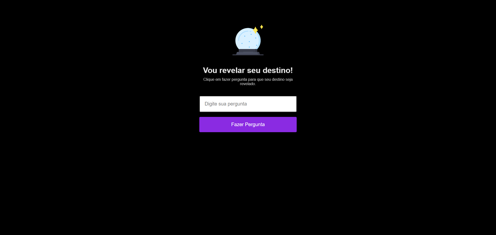

# Seu destino

>Projeto descubra seu destino

Projeto <b>'Seu Destino'</b> <u>Next Level Week da Rocketseat.</u>  
Faça perguntas de respostas 'sim' ou 'não' que iremos 'revelar seu destino'.

[🔗 Clique aqui para acessar](https://seu-destino.vercel.app/)

## 🌐 Tecnologias 

  
 
 
 
 

## 📱 Contato

<!-- ### imagem bola de cristal
https://gist.githubusercontent.com/maykbrito/0acdf4ce919838ffed50915a31fc5b23/raw/6f4dd01ec3116428ec4c99255944cb9ac7927590/cristal-ball.svg -->